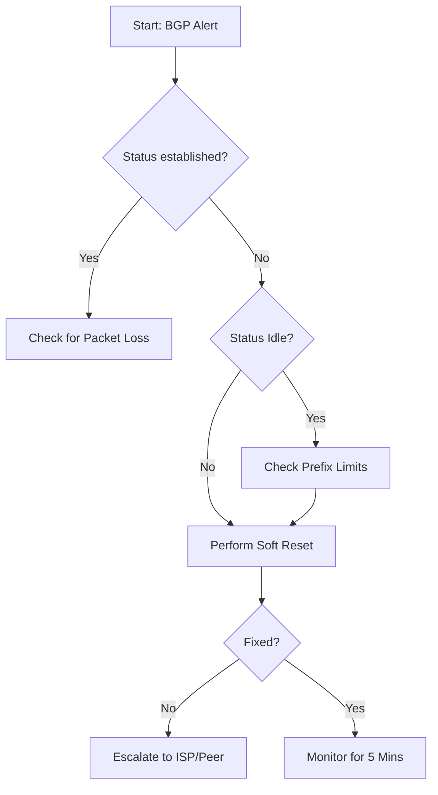

# Runbook: BGP Neighbor Session Reset

| Metadata | Details |
| :------- | :...... |
| Service ID | NET-BGP-02 |
| Severity | P1 (Critical Path) |
| Last Validated | 2026-03-26 |
| Owner | Core Infrastructure Team |

1. Description

This runbook covers the restoration of a BGP peering session that has fallen into an Idle or Active (non-established) state. This typically happens due to prefix limit violations or temporary path instability.

2. Decision Logic

3. Restoration Procedures

**Pre-Check: Verify State**

Before resetting, confirm which neighbor is down.

`show ip bgp summary`

Look for neighbors where the "State/PfxRcd" column does not show a number.

**Procedure A: Soft Reset (Recommended)**

A "Soft Reset" tells the router to ask the neighbor for a new routing table without actually tearing down the physical connection. This is non-disruptive.

# Clear inbound routing updates only
clear ip bgp 192.168.1.1 soft in

# Clear outbound routing updates only
clear ip bgp 192.168.1.1 soft out

Procedure B: Hard Reset (Last Resort)

Only use this if the Soft Reset fails. This will drop traffic for 30-60 seconds.

# Warning: This tears down the TCP session
clear ip bgp 192.168.1.1

4. Verification

Run the following command to ensure the session is back in the Established state:

show ip bgp neighbors 192.168.1.1 | include state

Success Criteria: The output should read BGP state = Established.

5. Escalation

If the session does not reach Established within 2 minutes of a Hard Reset:

Capture the output of show log.

Open a ticket with the Peer/ISP.

Notify the #network-ops Slack channel.
