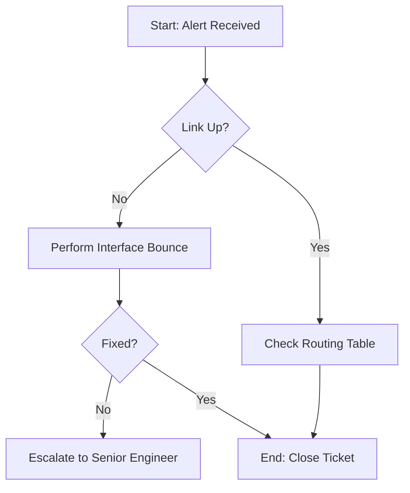

<!-- The file focuses on restoring a site-to-site IPsec tunnel, a common task that benefits from a repeatable proces -->
<!-- This runbook provides steps to diagnose and restore a dropped IPsec VPN tunnel between the Head Office (Everett, WA) and the Azure East Hub (fictional). -->

# Runbook: Site-to-Site VPN Restoration
**Service ID:** NET-VPN-01  
**Severity:** P2 (High)  
**Last Validated:** 2026-03-20  
**Owner:** Network Engineering Team  

---

<!-- Helps confirm the "State of the World" before they start changing configurations. -->

# Diagnostic Steps
1. Verify Tunnel Status
- Log into the primary firewall.
- Run: `show vpn ipsec sa` (or equivalent for your vendor).

2. Check Peer Reachability
- Ping the remote gateway IP from the outside interface.

3. Review Logs
- Filter logs for "Phase 1" or "Phase 2" failures.

# Restoration Procedures
<!-- Sample code snippet; engineer would provide usable code here -->
**WARNING**: Performing a "Hard Reset" on this router will drop all active connections for approximately 2 minutes. Do not perform this during peak business hours without approval.



# Option A: Soft Reset (Clear SA)
**NOTE**: If the tunnel is "stuck," clearing the Security Associations (SAs) often forces a fresh negotiation.
Bash:
```
# Example command for a Cisco-style CLI
clear crypto ipsec sa peer 203.0.113.10
clear crypto isakmp
```

# Option B: Interface Bounce 
<!-- **Definition**: Imagine you’re playing a video game and the controller suddenly stops responding. What’s the first thing you do? You unplug it and plug it back in. In the world of networking, an interface bounce is the exact same thing, but done with software commands instead of your hands. -->
If Phase 1 fails to initiate:
1. Enter configuration mode.
2. Shut/No-shut the tunnel interface.

# Verification & Escalation
<!-- How we know it's fixed -->
- Success Criteria: Tunnel status shows UP/ACTIVE. Traffic is passing across the 10.0.0.0/16 subnet.
- Escalation: If the tunnel does not stabilize after 15 minutes, page the On-Call Security Architect via PagerDuty.

