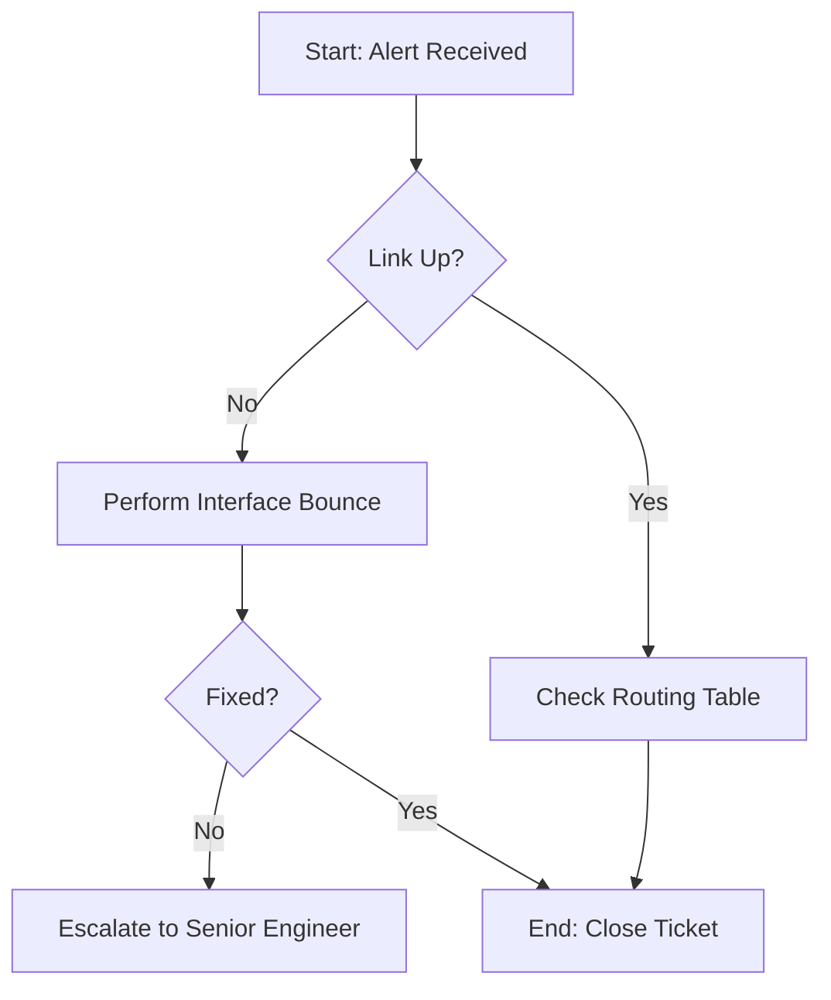

# [Runbook Title: for example, VPN Tunnel Restoration]

| Metadata | Details |
| :--- | :--- |
| **Service ID** | `NET-000` |
| **Severity** | [P1 / P2 / P3] |
| **Last Validated** | 2026-03-26 |
| **Owner** | Network Operations |

---

## 1. Executive Summary
**Goal:** What problem are we fixing? (e.g., "Restoring connectivity between Site A and Site B.")  
**Impact:** Who is affected if this service is down? (e.g., "All users in the Everett branch cannot access the ERP system.")

---

## 2. Troubleshooting Workflow
This diagram shows the "Decision Tree" for this specific restoration.

3. Restoration Procedures
⚠️ Pre-Check: The "Blast Radius"
Before running any commands, verify that a "Hard Reset" won't disconnect other critical services.

Check: Is this a redundant link?

Action: Notify the Help Desk before proceeding.

Procedure A: Interface Bounce (The "Off/On" Trick)
Use this if the physical port or software handshake is stuck.

Enter Configuration Mode:

Bash
configure terminal
interface [INTERFACE_NAME]
Shut Down the Port:

Bash
shutdown
Restart the Port:

Bash
no shutdown
Procedure B: Soft Reset (Clear Sessions)
Use this if the link is "Up" but data isn't moving.

Bash
# Example for BGP session reset
clear ip bgp * soft
4. Verification & Validation
How do we know the fix worked?

[ ] Ping Test: Can we reach 10.0.x.x?

[ ] Traffic Monitor: Are packets moving in the dashboard?

[ ] User Confirmation: Has the branch manager confirmed access?

5. Rollback Plan
If the procedures above make the connection worse, follow these steps to revert:

Re-enable any interfaces that were shut down.

Re-apply the last known "Good Configuration" from the /backups folder.

6. Escalation Contacts
If the issue is not resolved within 30 minutes, contact:

Primary: Network Lead (@username)

Secondary: Infrastructure Director

Channel: #ops-emergency on Slack

---
